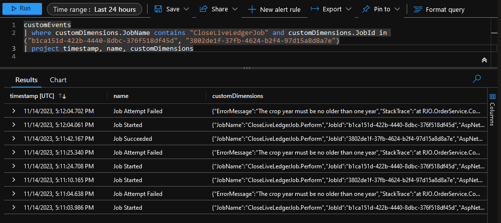

[](https://www.nuget.org/packages/Hulkstance.Hangfire.Analytics.ApplicationInsights)
[](https://www.nuget.org/packages/Hulkstance.Hangfire.Analytics.ApplicationInsights)


# Hangfire.Analytics.ApplicationInsights

Easily integrate Application Insights telemetry with Hangfire jobs for deeper insights and monitoring. This library provides a seamless way to track your Hangfire job executions in Application Insights, allowing for detailed analysis, failure tracking, and more.



# Features

- Automatic telemetry tracking for Hangfire job executions
- Track job success/failure metrics
- Get detailed insights into job arguments, execution context, and more

# Installation

Using NuGet:

```shell
Install-Package Hulkstance.Hangfire.Analytics.ApplicationInsights
```

Or via the .NET CLI:

```shell
dotnet add package Hulkstance.Hangfire.Analytics.ApplicationInsights
```

# Usage

## 1. Registering the telemetry service

In your `Program.cs` or wherever you configure services, add the following:

```csharp
services.AddApplicationInsightsTelemetryForHangfire();
```

## 2. Configuring Hangfire to use Application Insights

This section guides you on integrating Application Insights telemetry into your Hangfire setup.

### Basic Hangfire Setup

Start by setting up Hangfire as you usually would:

```csharp
services.AddHangfire((serviceProvider, globalConfiguration) => globalConfiguration
	.SetDataCompatibilityLevel(CompatibilityLevel.Version_170)
	.UseRecommendedSerializerSettings()
	.UseRedisStorage(redisConnectionString, redisStorageOptions)
	.UseBatches()
	.UseThrottling(ThrottlingAction.RetryJob, 1.Seconds())
	.UseTagsWithRedis(new() { TagsListStyle = TagsListStyle.Dropdown }, redisStorageOptions));
```

## Extending Hangfire with Application Insights Telemetry

To augment Hangfire with Application Insights monitoring, add the `.UseApplicationInsightsTelemetry(serviceProvider)` method to your configuration.

```csharp
  // ... other configurations
  .UseApplicationInsightsTelemetry(serviceProvider);
```

The above line integrates Application Insights telemetry into Hangfire. It taps into the Hangfire processing pipeline to send telemetry data to Application Insights every time a job is executed.

Here's the combined configuration:

```csharp
services.AddHangfire((serviceProvider, globalConfiguration) => globalConfiguration
  .SetDataCompatibilityLevel(CompatibilityLevel.Version_170)
  .UseRecommendedSerializerSettings()
  .UseRedisStorage(redisConnectionString, redisStorageOptions)
  .UseBatches()
  .UseThrottling(ThrottlingAction.RetryJob, 1.Seconds())
  .UseTagsWithRedis(new() { TagsListStyle = TagsListStyle.Dropdown }, redisStorageOptions)
  .UseApplicationInsightsTelemetry(serviceProvider)); // This integrates Application Insights telemetry
```

With this setup, every Hangfire job processed will send telemetry data to Application Insights, giving you a comprehensive view of job performance, failures, and other essential metrics.

# Application Insights Queries

Once you've integrated `Hangfire.Analytics.ApplicationInsights`, you can leverage the power of Application Insights to get insights into your Hangfire jobs. Here are a few sample Kusto Query Language (KQL) queries to get you started:

## View All Hangfire Job Executions

```kql
requests
| where customDimensions.JobId != ""
| project timestamp, name, customDimensions.JobId, customDimensions.Arguments, duration, success
```

## View Failed Hangfire Job Executions

```kql
requests
| where customDimensions.JobId != "" and success == "False"
| project timestamp, name, customDimensions.JobId, customDimensions.Arguments, duration, resultCode
```

## View Job Execution Duration Over Time

```kql
requests
| where customDimensions.JobId != ""
| summarize avg(duration) by bin(timestamp, 1h)
| render timechart
```

## Count of Jobs by Type

```kql
requests
| where customDimensions.JobId != ""
| summarize count() by tostring(name)
| order by count_ desc
```

These are just starting points! You can do way more with Application Insights.

# How it Works

Under the hood, all processes in Hangfire are implemented with the Chain of Responsibility pattern, so they can be intercepted. `Hangfire.Analytics.ApplicationInsights` uses an `IServerFilter` to intercept `OnPerforming` and `OnPerformed`. This allows us to extend the original functionality with our logic that communicates telemetry data to Application Insights. The telemetry data can then be queried and analyzed in the Azure Portal.

# Contributing

Contributions, issues, and feature requests are welcome! Feel free to check the [issues page](https://github.com/Hulkstance/Hangfire.Analytics.ApplicationInsights/issues).
